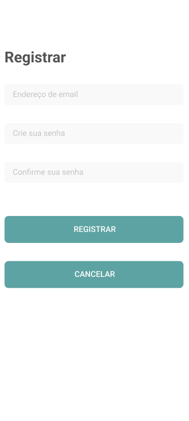

# DesafioTecnicoFlutter-MeusGastos

## Desafio tecnico de Flutter - App Meus gastos

O objetivo deste teste é avaliar as habilidades do candidato em desenvolver um aplicativo para
controle de gastos.

Os protótipos de telas estão no repositório para desenvolvimento do layout.

O tempo estimado para a conclusão deste teste é de 1 semana, entregar o melhor app possível visando
a qualidade de código/projeto e a parte visual.

## **Requisitos de negócio:**

- No primeiro acesso ao aplicativo, o usuário deverá fazer o registro;
- Tratamento de erros no processo de login;
- Cadastro de categorias de gastos, como:
    - Moradia (aluguel)
    - Alimentação
    - Transporte
    - Educação
- O usuário poderá cadastrar entradas e saídas de gastos;
    - Cadastrar no mínimo 2 valores, 1 entrada e 1 saída, para cada categoria.
- Possibilidade de exclusão e edição dos gastos e categorias cadastrados;
- Tratamento de erros nas requisições da API;
- Na tela de GastosInfo, exibir totalizadores com a soma dos valores de entrada e saída.

## **Requisitos técnicos:**

- Utilizar última versão do Flutter do Stable channel disponível
  em https://docs.flutter.dev/release/archive;
- Utilizar chamadas às APIs disponíveis;
- Respeitar os princípios do SOLID;
- Boas práticas, CleanCode;
- Aplicar Design Patterns, orientação a objetos e boas práticas de programação;
- Utilizar componentização de Widgets;
- Seguir a arquitetura Clean Architecture;
- Implementar o login utilizando o Firebase;
- Usar o plugin Dio para chamadas de API - https://pub.dev/packages/dio;
- Os testes unitários são opcionais, porém recomendados.

Utilize a
seguinte [API](http://meusgastos.codandocommoa.com.br/swagger/ui/index#/Category/Category_GetCategoryById)
.

| Não envie a solução como anexo, suba os fontes para seu Github (ou outro repositório) e envie o
link para o avaliador.

### Detalhes técnicos sobre a API:

- A API é HTTP, não HTTPS;
- Para salvar ou obter categorias, não precisará do EntryType, ele não precisa ser
  enviado no HTTP Body e nem virá como response;
- Nenhum item precisará de DataCriacao, DataAlteracao e Uid, mesmo que estejam
  na API;
- O EntryType poderá ser String ou Int, no caso, o POST deve-se mandar o nome do
  elemento do vetor [“Entrada”, “Saida”] como String e no GET, a resposta será do
  índice do vetor [“Entrada”, “Saida”] que virá como Int;
- Ao salvar o lançamento, enviar o valor do CategoryId como Int e a categoria como
  nula. A categoria será obtida pela chamada /Api/Categorys/GetCategoryById.

## Login

<kbd>
  
  
</kbd>

## Categorias

<kbd>
  
  
  
   
  
  
</kbd>

## Gastos

<kbd>
  
  
  
   
  
   
  
  
  
</kbd>
